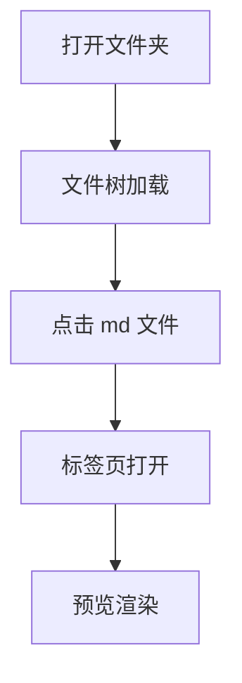
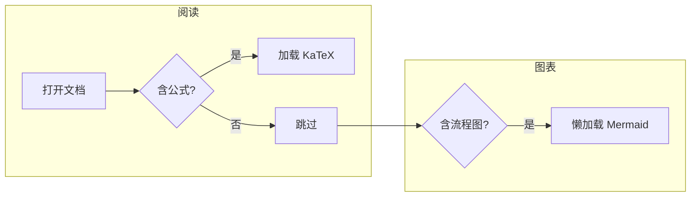
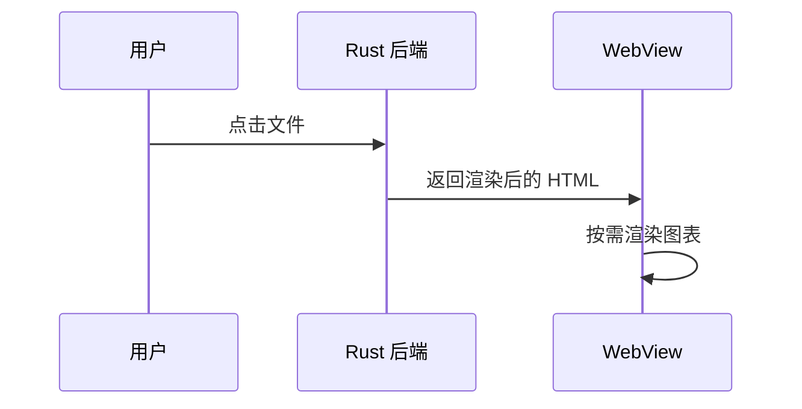

# 📖 markdown阅读器 - 示例文档

欢迎使用 **markdown阅读器**。这是一个"打开即预览"的 markdown 阅读器。

## 功能速览

- ✅ 左侧：文件夹树，点击任意 md 文件立即预览
- ✅ 顶部：标签页，可同时打开多个文档
- ✅ 记忆：启动自动回到上次的文档和阅读位置
- ✅ 自动刷新：文件被外部修改后预览自动更新
- ✅ 全文搜索：顶部搜索框，按文件名或内容查找

## 试试这些功能

### 1. 代码高亮

```rust
fn main() {
    let message = "你好，Rust + Tauri!";
    println!("{message}");
}
```

```python
def fib(n: int) -> int:
    return n if n < 2 else fib(n - 1) + fib(n - 2)
```

### 2. 数学公式（KaTeX，按需加载）

行内公式：$E = mc^2$，质能方程。

块级公式：

$$
\int_{-\infty}^{+\infty} e^{-x^2}\,dx = \sqrt{\pi}
$$

### 3. Mermaid 流程图（按需加载）



支持子图、判断与分支（`flowchart`）：



时序图等其它图表类型同样可用：



### 4. 本地图片


### 5. 任务列表

- [x] 打开即预览
- [x] 侧边栏文件树
- [x] 标签页切换
- [ ] ？你来提需求

### 6. 表格与引用

| 功能 | 状态 | 说明 |
| --- | --- | --- |
| 桌面端 | ✅ | Windows 原生体验 |
| 安卓平板 | 🚧 | SAF 目录授权 |

> 提示：点击左侧其他文件试试标签页；关闭标签后再打开，会回到上次的阅读位置。

### 7. 内部链接跳转

看下一篇： [日记示例](日记/2026-07-14.md)